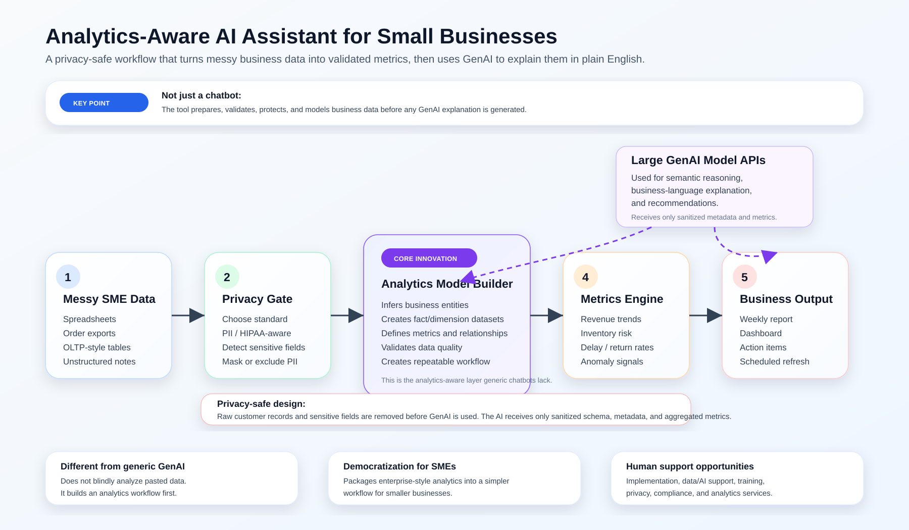
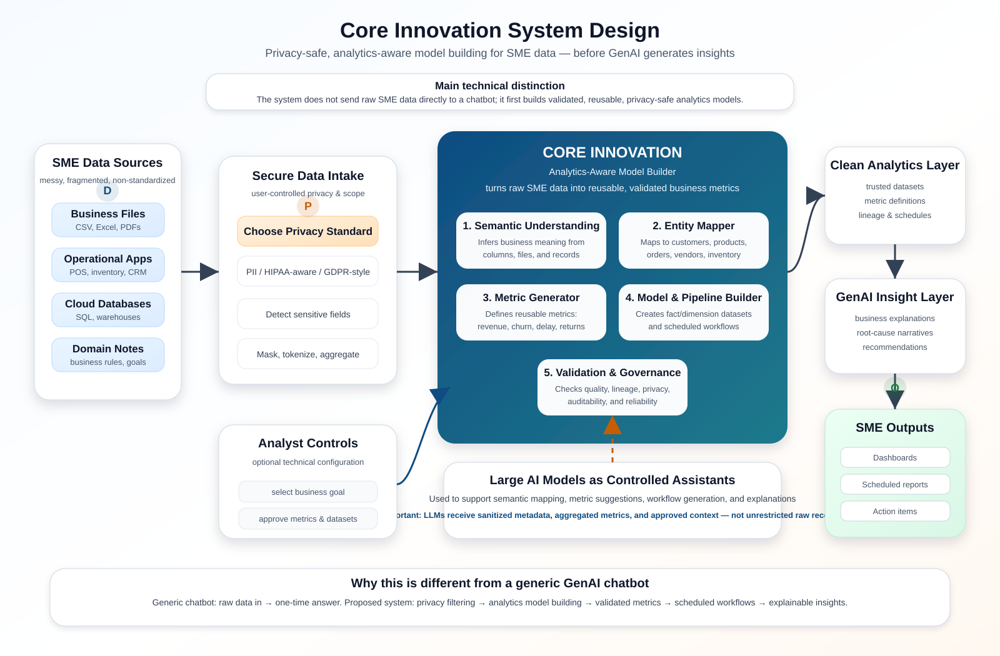

# Privacy-Safe SME Data Co-Pilot

Visit the link to see the prototype: https://tinyurl.com/smecopilot

A focused Streamlit prototype showing how a small business can turn messy operational data into validated, privacy-safe analytics and an AI-assisted weekly operations report.

## What this prototype demonstrates

This is not a generic chatbot demo. The app demonstrates a privacy-aware analytics workflow:

1. A user selects a privacy scan mode such as PII Baseline, HIPAA-aware, GDPR-aware, PCI-aware, or Strict.
2. The app detects sensitive fields before AI use.
3. The app validates business data quality.
4. The app creates analytics-ready fact/dimension-style previews.
5. The app computes business metrics locally using deterministic code.
6. The app shows a simple workflow for creating scheduled reporting datasets.
7. The app tracks reporting datasets with last run date, success status, runtime, and output.
8. The app generates an automated dashboard.
9. The app sends only safe aggregated metrics to the AI report layer.

## Why it is different from general GenAI tools

General GenAI tools can answer broad questions, but they often require a user to paste raw data and context into a chat window. This prototype is designed as a data-analytics-aware workflow for small businesses.

| Generic GenAI tool | This prototype |
|---|---|
| User manually pastes data into chat | User uploads structured, semi-structured, or raw operational data |
| Treats data mostly as text | Understands data as transactions, entities, metrics, and relationships |
| May expose raw customer/business data | Lets the user choose a privacy standard and excludes sensitive fields before AI use |
| May not verify calculations | Computes metrics locally using deterministic code before AI summarizes |
| Depends heavily on prompt quality | Uses validation, schema inference, metric definitions, and business rules |
| Often one-off conversation | Creates repeatable scheduled reporting datasets |
| Not SME-specific | Designed around small-business operations, inventory, fulfillment, returns, delays, and reporting |

## Prototype scope

This prototype uses synthetic data by default. It is not a production system, commercial deployment, compliance certification, or legal/medical/financial advice tool.

## Run locally

```bash
python -m venv .venv
source .venv/bin/activate
python -m pip install --upgrade pip setuptools wheel
pip install -r requirements.txt
streamlit run app.py
```

For Python 3.13, this version uses modern dependency ranges that avoid older NumPy wheels.

## Recommended demo flow

1. Open the app and keep synthetic data selected.
2. Choose `PII Baseline` or `Strict: PII + HIPAA + GDPR + PCI` in the sidebar.
3. Open **Privacy Scan** to show sensitive fields being excluded.
4. Open **Create My Own Data for Reporting** to show the simple flowchart and scheduled reporting-dataset table.
5. Open **Automated Dashboard** to show business metrics and risk flags.
6. Open **Analytics Model** to show fact/dimension-style tables.
7. Open **AI Report** to show the safe aggregated payload and the weekly operations report.
8. Open **Why It Is Different** to explain the difference from generic GenAI and the democratization/employment angle.

This prototype demonstrates a focused implementation of a privacy-safe AI analytics assistant for SMEs. Unlike general GenAI use, the prototype first detects and excludes sensitive fields, validates data, creates analytics-ready structures, computes metrics locally, and sends only aggregated information to the AI layer for plain-English reporting. It illustrates how secure data engineering and GenAI can be combined to make analytics more accessible for small businesses while reducing privacy risk.

## System Design

### High-Level System Design

The following diagram shows the overall architecture of the SME Analytics-Aware Copilot. It illustrates how raw SME business data flows through privacy-aware processing, analytics modeling, GenAI-assisted insight generation, and user-facing reporting workflows.

<p align="center">
  
</p>

---

### Core Innovation: Analytics-Aware Data Modeller

The core innovation of this system is the Analytics-Aware Data Modeller. Instead of allowing a generic chatbot to directly analyze raw business data, this layer transforms messy SME data into privacy-safe, validated, reusable analytics models.

It identifies business entities, maps relationships, defines reusable metrics, applies privacy-aware transformations, validates data quality, and prepares AI-ready analytical context for GenAI-powered explanations and recommendations.

<p align="center">
  
</p>
